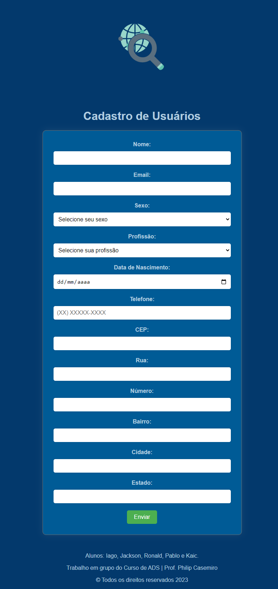

# Cadastramento de usuários.

> Trabalho em Grupo do Curso de Análise e Desenvolvimento de Sistemas.

> Grupo: Iago, Jackson, Ronald, Pablo e Kaic.

> Prof. Philip Casemiro

 
 

# Front-end do projeto.

 

🔗 [Clique aqui para acessar o projeto.](https://kaicbrito.github.io/novoFormulario)

## 🛠 Tecnologias usadas;

- HTML
- CSS
- JavaScript
- API
- Git e Github.
